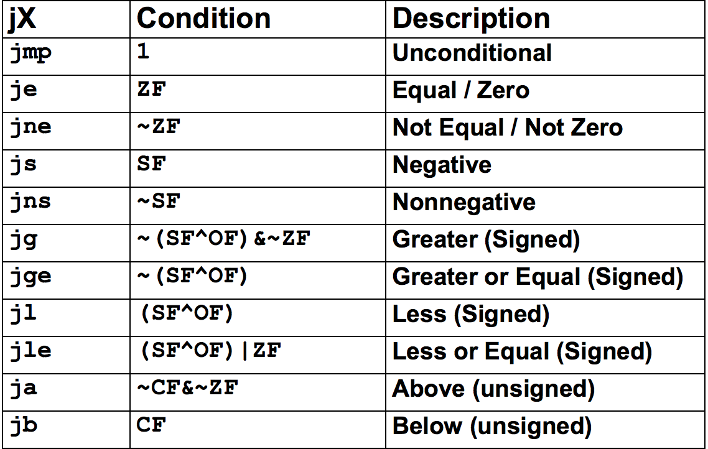

# CS211 Midterm I Study Guide
## Recent Trends In Hardware
### Main Components In Computer
Include: Cpu, Memory, Bus, I/O Devices like keyboards, graphics, neworking, and storage.
### Von Neumann Model
Computers are seperated into three parts: memory, control unit, and arithmetic and logic unit. Moery stores data and instructions. The control unit fetches further instructions. the arithmetic and logic units do operations based on the instrucitons passed.
### Basic CPU Function
Fetch --> Decode --> Execute
### Running on Hardware
**High - Level Language**

```c
x = x + y;
```   
**Assembly Language**

```nasm
mov -0x8(%esp),%ebx
add %ebx, %eax
```  
**Machine Language**

```
7F 45 4C 46 01 01 01…
```  
### Operating System
Provides essential services to programs running on hardware such as virtual memory, multitasking, etc...
### Moore's Law
An observation that the number of transistors on chip double every 18 month. Can also be seen in processor speed, memory capacity, and disk capacity, which doubles 18 months, two years and every year, relativly speaking.
## The C Language
### Compared to Java
Java source code is compiled into byte code, runs in the jvm and finally on the hardware and OS. C is compiled and run in the hardware and OS.
### Comments
Denoted using `/* */` or `//`
### Variable Declaration
Starts with an optional modifier, type and then the name. `short int x;` `long double y;` `char z;`
### Basic Datatypes
There exits: ***char***, ***int***, ***float***, ***double***, with modifiers ***short***, ***long***, and ***signed***, ***unsigned***.
### Arithmetic Operatiors
Contains `*, /, %, +, -, ++, --`. Remember that `x++` changes the value after it is used and `++x` changes the value before it is used. Same with `x--` and `--x`.
### Relational Operators
Include: `>, >=, <. <=, ==, !=`. The result is 1 (TRUE) or 0 (FALSE).
### Bit Operators
Contains the symbols: `~` complement used as `~x`, `&` bit AND used as `x & y`, and `|` bit OR used as `x | y`.
### Expressions and Assignments
Expressions are computations with a result. Example: `x + y * z`. Be aware that c does explicit type conversion with double being the rank and char/short int being the lowest rank. Assignments work by setting the value of an expression to a variable. Example: `a = x + y * z`.
### Control Statements
Conditional: if else, switch. Iteration: while, for, do while. Goto: break, continue, goto.
### If Statements
Keeps on evaluating expressions until one found with non-zero result.

```c
if (condition 1) {
    body...
} else if (condition 2) {
    body...
} else {
    body...
}
```

### Switch Statements
Evaluates an integer expression and after finding the 1st case with matching contatcy executes statements until encountering break or end of switch. Remember to include a default case.

```c
switch(expr) {
    case 1:
        statement 1;
    case 2:
        statement 2;
    defualt:
        statement 3;
}
```
### Loops

```c
// for
for (i = 0; i < 10; i ++) {
    ...
}
// while
while (i < 10) {
    ...
    i++;
}
// do while
do {
    ...
    i++
} while (i < 10)
```

### Specialized Go-to's
The `break` statement forces an immediate exit from siwtch or loop and goes to the code following that switch or loop. The `continue` statements skips the rest of the code in the body of a loop and restarts the loop.
### Functions
Components include: Name, Return type, Parameers, and Body.

```c
int Factorial(int n) {
	int i;
	int result = 1;
	for (i = 1; i <= n; i++) {
		result *= i;
	}
	return result;
}
```
### Function Calls
Functions that are not void can be used as a part of an expression `x = factorial(5)`. Functions that are void can be used as a statement `printList()`.
### Function Prototypes
In c, function prototypes are required when you use a function before you have implemented it.
### Input and Output
Contained in `stdio.h`. Two common functions are `printf("%d\n", counter);` and `scanf("%d", &startPoint);`.
### Memory
C's memory model is the same as the underlying virtual memory system. Variables are simply names for contiguous sequences of bytes. Variable names are equivelent to memory addresses.
### Pointers
Pointers are a variable that store an address. Declared as `type *pointer_name`. `*` is the dereference operator which ives the value stored at the address pointed to: `*p`. `&` gives the address of a variable: `&v`.
### Null Pointer
NULL is a predefined constant that contains a value that is an illegal address so we know it points to nothing. Usually `Null = 0`.
### Type Casting
Note that C is not strongly typed.
### Arrays
Arrays are contiguous sequences of data items of the same type. Declaration: `type name[amount]` --> `int nums[10]`
Array indexs always start at zero. C compiler and runtime does not check for boudaries.
### Array Storage
Elements in array are stored contigously in memory so if you know where the first item is and the length, you can access every element using offsets.
### Arrays and Pointers
Arrays are basically syntactic sugar for pointers.

```c
 char word[10];
 char *cptr;
 cptr = word; /* points to word[0] */
```
### Pointer Arithmetic
You can increment or decrement pointers by an offset to access memory adjacent to the pointer. Don't go out of bounds.
### Passing Arrays as Arguments
Arrays are baessed by reference but array items are passed by value. This means there will be pointer decay and the size of the the array is lost when passed to a function.
### Common Array Errors in C
Do not overrun array limits due to no out of bounds checking and the size of an array must be known at compile time.
### Strings
C strings are stored as arrays of characters with a null terminator. Make sure you leave an extra space for `\0`.
Some useful functions include strcpy, strcmp. and strlen.
### Structures
Groups together related data of different data types kind of like objects. Defined as:

```c
struct person {
	int height;
	int weight;
	char *name;
};
```
It tells the compiler how big the struct is and how the data items are laid out in memory. To declare a struct: `struct person john;`. Declaration can be simplified by using a typdef.


```c
typedef struct Persons {
int height;
	int weight;
	char *name;
} Person;
```
Now we can declare a person by simply doing `Person john;`.
### Pointer to Structs
To declare a pointer to a struct: `struct Person *john;`. To access members of struct we can use the dot operator `.` and dereference it `(*person).name` or just the special arrow operator `->` directly `person->name `.
### Dynamic Allocation
We need dynamic memory allocation when we don't how much data we have during compile time. These varibles are declared on the heap rather than the stack.
### Memory Management 101
When a function call is performed the run-time system allocates resources such as local vars, arguments, and results. The state associated with a particular function is called an ***activation record***.
### Allocating on the Stack
The stack grows downwards in the activation record and when the function call returns, all activation records are removed.
### Allocating on the Heap
Also known as dynamic memory allocation, we ask the run time system for a chunk of memory which lives on after the function that created it has returned unlike variables on the stack. Commands include: `malloc` for creation and `free` for destruction.
### Using malloc
The sizeof operator returns the size of either a type or a variable. Use that multiplied by the amount of the data type you want stored `int *nums = malloc(sizeof(nums) * count);`.
### Using free
You need to free unused memory to prevent leaks. `free(nums);`
### typedef
Used to name types for convenience. `typedef <type> <name>;`
### Preprocessor
Examples are include statements and macros.
`#include <stdio.h>;`
`#define MAX_SIZE 12;`
### Standard C Library
Lots of useful stuff in it for I/O, String handling, File Manipulation, etc...
### Command Line Arguments
When using shell: `$ hello 5` white spaces are used to sperate characters but is shell dependent. `argc` contains the count of command arguments passed + 1 because the first command line argument will be the name of the program. Likewise, `argv[]` will contain the strings themselves, but remember `argv[1]` is usually the name of the program.
### fopen
Opens a file in your program. `FILE *fopen(char* name, char* mode);` The first argument is the path of the file you want to open and the second argument contains the modes `r` for read, `w` for write starting at the beginning of the file and `a` for writing starting at the end of the file.
### fprintf and fscanf
Once open, a file written to or read from using `fprintf()` like: `fprintf(outfile, "The answer is %d\n", x);` and `fscanf()` like `fscanf(infile, "%s %d/%d/%d %lf",
 &name, &bMonth, &bDay, &bYear, &gpa);`.
Remember that programs have three streams open `stdin, stdout, sterr`.
### Multidimensional Arrays
On the stack they can be declared as `array[ROWS][COLS]`. When passing them to a function, the rows dimension can be dropped, but the number of culumns is needed. `void transpose(double matrix[][3]);`
### Double Pointers
Single pointers and single dimension arrays can be used interchangably but for higher dimensions char[X][Y] is simple an array of arrays all of the items are stored contigously in memory as a rectangle. It would look something like this: `char[2][2] = [item(0,0) , item(0,1), item(1,0), item(1,1)]`. On the other hand, `char **argv` is just a pointer to a pointer.
### Allocating Multidimensional Arrays
#### Single Pointer
There are two ways you can dynamically allocate a 2d array. The first is to flatten the 2d array by allocating `x = rows * cols` memory using `data_type *arr = malloc(sizeof(data_type) * x)`. Afterwards you can access the nth row and mth column using this offset: `arr[n*cols) + m]`  This is similar to how the stack allocates 2d arrays. 
#### Double Pointer
First allocate a 1d array of pointers corresponding to how many rows the array has. `data_type **arr = malloc(sizeof(int *) * rows);`. Then you use a nested for loop make each of those pointers point to a 1d array of the actual data you want. `arr[i][j] = malloc(sizeof(int) * cols);`
### Compilation
**C Source code --> Pre-processor --> Compiler --> Assembly --> Assembler --> Relocatable Object --> Linker --> Executable**  
Seperate compilation follows the same steps but links the multiple relocatable objects together at the end.
## Datatypes
### Running on Hardware
The ISA (Instruction Set Architecture) interfaces between the soft ware and hardware.
### Base n Notation
Numbers are written as a sequence of digits that are multiplied by a place value. For example in base 10, one hundred and twelve is written as: `1 * 10^2 + 1 * 10^1 + 2 * 10^0`
### Base 2: Binary
The only digits are 0 and 1 in binary. A bit is one binary digit. Binary is good for computers because you can represent them as on/off switches, but are hard to read for humans.
### Base 16: Hexadecimal
Digits include 0-9 and A-F which represent ten through fifteen. Since 16 = 2^4, one hex digit is 4 bits. Bytes are two hex digits (00-FF).
### Base 8: Octal
Digits are 0-7. More compact that binary where one octal digit is 3 bits.
### Base Conversions
You want to convert the number you are changing to base 10 first. Then you can repeatedly divide by the base you want to the whatever power you need and then divide again until there is no remainder. To convert 100 to base 8, we know its 1(8^2) + 4(8^1) + 4(8^0) = 144base8
### Base n Rationals
Decimals can be represented past the "radix" (decimal) point by multiplying by negative powers of n.
### Value vs Notation
Decimals, binary, and hex are just ways to write numbers. Computers use binary to encode integers and perform arithmetic. Computers simply convert to decimal when outputting floats and ints.
### Data Sizes
Primitive number types used a fixed number of digits and are usually multiples of 8 as 8 bits = 1 byte. Chars are 1 byte, ints are 2 or 4 bytes, pointers are 4 or 9 bytes, floats are 4 bytes, and doubles are 8 bytes.
### Big and Little-Endian
Large data types consist of multiple bytes so you have to split them up to store them. Lets consider a large number like `AB10CD2F`. Big Endian stores the most significant byte at the smallest address `AB 10 CD 2F`. Little Endian stores the least significant byte at the smallest address `2F CD 10 AB`. Most network standards are big-endian and some file formats have byte-order marks.
### Encoding Data
We can encode things by using bits. For example a playing card has 4 suits, and 13 ranks. We can simply use one byte where 4 bits represent the rank 2 two bits represent the suit.
### Negative Integers
In writing we denote negative numbers with a negative sign `-`. We can designate a bit to be the signed like `4 = 0100` and `-4 = 1100` but this results in two zero values which is inconvenient for arithmetic `0 = 0000` and `-0 = 1000`.
### 1s' Complement
We can find -x by simply negating the bits of x. `001 = 1` `110 = -1`
However, there are still two zeros and is inconvenient for arithmetic.
### 2s' Complement
We can make the most significant bit negative so that to find -x we simply negate the bits in x and add 1. This gets rid of the extra zero problem but there in an extra minimum value. Adding, subtracting, and multiplying works without changes and is now used on most computers. Remember that 0 signifies positive and 1 signifies negative. `100 = -4` `101 = -3` `110 = -2` `111 = -1` `000 = 0` `001 = 1` `010 = 2` `011 = 3`
### Range of 2s' Complement
For unsigned integers, k bits you can represent 2^k values. If they are natural numbers the range is `0 through 2^k-1`. However for 2s' complement the minimum value of x for k bits is `-2^(k-1)` and the maximum value is `2^(k-1) - 1`. This is because we add one to the negated value.
### 2'z Complement Addition & Subtraction
Addition is the same as unsigned binary addition but subtration requires us to invert the subtrahend and add. We also ignore the carries.
### Multiplication
It's the same thing as normal multiplication but just with ones and zeros. We only need to know add and shift to multiply.
### Divison
It's complicated.
### Unsigned Ints in C
Declared as `unsigned int i = 10;`. To cast just do `i = (unsigned) j;`. Casting will leave bits unchanged so `(unsigned) -1 = 2^k = 1` where k is the number of bits the integer has.
### Bit Shifting
The operators `<<` and `>>` shift an integer by some number of places to the left or right. Remember that shifting left is equivilent to multiplying by 2 `n << c = n × 2^c` and shifting right is equivilent to dividing by 2 `n << c = n × 2^c`.
## Floating Point
### Scientific Notation
A more compact way of writing long decimal numbers by distinguishing magnitude from precision. In base 10 we have `1,250,000 = 1.25 × 10^6` and in base 2 we have `0.00101 = 1.01 × 2^-3`.
### Fixed-Point Numbers
We need to chose an exponent (b^e) and mantissa (m) which are both integers. For example for 10.50 `m = 1050 ` and `b^e = 10^-2`. We can simply use integer operations to add and subtract. To multiply we use integer multiplication and then we multuply by b^e. For example: `(45 × 10-2)(1000 × 10-2) = (45 × 1000 × 10-2) × 10-2 = 450 × 10-2`. Remember that values closer to 0 are more precise because floating point numbers get more dense.
### IEEE 754 Floating-Point
This is the most commonly used representation for floating-oint and defines single (32 bit), double (64 bit), and extended (80 bit) precisions. Some processors support half (16 bit) or quad (128 bit) too.
### Normal Values
IEEE FP numbers have three parts: the sign `s`, exponenet `e`, and significand `m`. `s` is always one bit but `e` and `m` can depend on precision. Normal values are represented as `(-1)^s * m * 2^(e - bias(E)`, where 1 ≤ m < 2. The `bias(E) = 2^(E–1)–1`, where E is the number of bits in e where `e ≠ 0` and` e ≠ 2^(E–1)`(e.g., all ones).
### Other Values
Zero and denormal values are less than any normal value. This is when `(-1)^s * m * 2^(e - bias(E)`, where `0 ≤ m < 1`. The value is zero when `m = 0` and `e = 0`. Denormal if `m ≠ 0 and e = 0`. There are also nonfinite values `±∞` if `m = 0` and `e = 2^E –1` (all ones) and NaN if `m ≠ 0` and `e = 2^E –1` (all ones).
### Conversion to FP
In single precision, E = 8, M = 23 (mantissa bits). Lets convert `5.625`. First we rewrite it in binary: `101.101`. Then rewrite in scientific notation: `1.01101 * 2^2`. Now we solve for `e - bias(E) = 2` and we get `bias(E) = 127` so `e = 129 = 10000001`. We then drop the integer part of m and extend to M bits: ` 01101000000000000000000`. Final answer: `0 100000001 01101000000000000000000`.
## Assembly
### Programming Meets Hardware
High-Level Language Program --> Assembly Language Program --> Machine Language Program
### Performance with PRgraoms
1. Program: Data structures + algorithms
2. Compiler Translates code
3. Instruction set architecture
4. Hardware Implementation

### Instruction Set Architecture (ISA)
ISA is a set of instructions that the CPU can execute. It also gives information on the state of the system regarding registers, memory state, and program counter. Example: what instruction to execute next, how many and how large registers are, and how we specify memory addresses.
### IA32 (X86 ISA)
There are many assembly languages as they are processor-specific. Some examples are IA32, IA64, PowerPC, and MIPS.
### X86 Evolution
8086 – 1978 – 29K transistors – 5-10MHz  
I386 – 1985 – 275K transistors – 16-33 MHz  
Pentium4 – 2005 – 230M transistors – 2800-3800 MHz  
Haswell – 2013 – > 2B transistors – 3200-3900 MHz  
Some added features include larger caches, multiple cores and support for data parrallelism (SIMD, and AVX extensions.
### CISC vs RISC
CISC (complex instruction set) are usex by x86 have more complicated instructions but reduce code size and have a more complex hardware implenetation. RISC (reduce instruction set) like ARM have simpler instructions but large code size, and simpler hardware implmentation.
Note that CISC implementation like x86 are good for backwards compatability but bad for taking advantage of hardware advances.
### Assembly Programming
We use assembly because it interfaces closely with hardware. It is better than binary because it is much easier for us to read and we can use relative instead of absolute addresses.
### Memory
The main memory is a massive array of bits where we can store and read information from.
### Processor: ALU and Registers
The ALU performs arithmetic and logical operations while the registers act as temporary storage for information we need to work with.
### C, Assembly Codem and Machine Code
Suppose we have the following c code:

```c
int accum;
int sum(int x, int y)
{
	int t = x + y;
	accum += t;
	return t;
}
```
We can convert it to assembly using `gcc -O1 -m32 –S code.c`.

```nasm
sum:
	push %ebp
	movl %esp, %ebp
	movl 12(%ebp), %eax
	addl 8(%ebp), %eax
	addl %eax, accum
	popl %ebp
	ret
```
We can get machine code using `objdump –d code.o`.

```
0000000 <sum>:
 0: 55 						push %ebp
 1: 89 e5 					mov %esp,%ebp
 3: 8b 45 0c 				mov 0xc(%ebp),%eax
 6: 03 45 08 				add 0x8(%ebp),%eax
 9: 01 05 00 00 00 00 		add %eax, accum
 f: 5d 						pop %ebp
 10: 						c3 ret
```
### Assembly Characteristics
#### Data Types
Assembly has no real data types. There is only integer data of 1, 2, or 4 bytes of data values and address (untyped pointers), Floating point data of 4, 8, or 10 bytes, and contigiously allocated bytes in memory that are equivilent to arrays and structures. 
#### Type Checking
Note that there is no type checking so there is no protection from misinterpretation of data.
#### Operations
The only operations allowed are arithmetic function on register or memory data, transfering data from memory and register, and transfer control in the form of unconditional jumps and conditional branches.
### x86 Characteristics
There are variable length instructions from 1 to 15 bytes, can address memory directly in most instructions, and uses Little-Endian format.
### Instruction Format
Generally we have `opcode operands`. Opcodes are short memonics for instructions purpose like `movb` or `addl`. Operands can be immediate, register, or memory. The number of operands passed depend on the command. For example: `movl %ebx, (%ecx)`.
### Machine Representation
`| OPCODE | ADDRESSING MODE | OTHER BYTES |`  
Assembly instructions are translated into a sequences of 1-15 bytes where the first part is the binary opcode and then instruction for the addressing mode which include the type of operands and how to interpret the operands. Some instructions like `pushl` are single byte because their addressing mode are implicitly specified.
### x86 Regusters
General purpose registers are 32 bits with 16 and 8 bit subregisters contained within. There are data registers (EAX, EBX, ECX, EDX) and pointer/index registers (EBP, ESP, EIP,ESI,EDI), and segment registers (CS, DS, SS, ES).
### Data Format
We have **Byte**: 8 bit, **Word**: 18 bits, **Double Word**: 32 bits, **Quad Word** 64 bits. Instructions can operate on any data size: `movl` on double word, `movw` on word, `movb` on byte.
### MOV Instruction
Follows the format `Mov SRC, DEST` where SRC and DEST are operands. SRC can be the contents of register, memory location, constant, or a label. DEST is a register or location in memory. MOV is used to copy data from constant to register, memory to register, register to memory, or register to register. You cannot copy memory to memory in a single instruction.
### Immediate Addressing
The operand (value found immediatly followign instruction) is encoded in 1, 2, or 4 bytes. There must be a `$` in front of the immediate operand. For example `movl $0x4040, %eax` moves the hexidecimal 4040 into register eax.
### Register Mode Addressing
We use `%` to denote a register: `%eax`. We use the value stored in the source operand and another register as destination for value.

```nasm
movl %eax, %ebx 	; Copies content of %eax into %ebx
movl $0x4040, %eax 	; Immediate addressing, copies 0x4040 into %eax
movl %eax, 0x0000f	; Absolute addressing, copies contents of %eax to memory location of 0x0000f
```
### Indirect Mode Addressing
We use the content of operand as an address. Designated with parentheses around operand. An offset can be specified as immediate mode. We can think of this as dereferencing a pointer. When using an offset, we can think of it as something similar to pointer arithmetic.

```nasm
movl (%ebp), %eax
; We use the value stored in %ebp as a memory address and then take the
; value at that memory address and copy it into %eax
movl -4(%ebp), %eax
; We treat the value in #ebp as memory, find the address -4 away from it
; and then we copy the contents at that ofsetted address into %eax
```
### Indexed Mode Addressing
We can add the contents of two registers to get address of operand. This is particularily useful wen dealing with arrays because we can have one register hold the base address while the other one holds the index. Note that Index cannot be ESP.

```nasm
movl (%ebp, %esi), %eax ; Copy the value at (address = ebp + esi) into eax
movl 8(%ebp, %esi), %eax ; Copy the value at (address = * + ebp +esi) into eax
```
### Scaled Indexed Mode Addressing
On top of Index Mode Addressing, Scaled Index Mode Addressing allows us to multiply the second operand by the scale (1, 2, 4, or 8).

```nasm
movl 0x80(%ebx, %esi, 4), %eax
; Copy the value at (address = ebx + esi * 4 + 0x80) into eax
```
This can be useful when dealing with structs or larger data types where we can scale by its size.
### Address Computation Examples
Given `%edx = 0xf000` and `%ecx = 0x100`, lets compute the following addressing expressions. 
`0x8(%edx) = 0x8 + 0xf000 = 0xf008`  
`(%edx,%ecx) = 0xf000 + 0x100 = 0xf100`  
`(%edx,%ecx,4) = 0xf000 + 0x100 * 4 = 0xf400`  
`0x80(,%edx,2) = 0x80 + 0 + 0xf000 * 2 = 0x1e080`
### movl Operand Combinations
#### Immediate
##### Register
The constant 0x4 is stored into register eax.  
`movl $0x4,%eax` --> `temp = 0x4;`  
##### Memory
The constant -147 is stored into an memory address stored in register eax.  
`movl $-147,(%eax)` --> `*p = -147;`
#### Register
##### Register
The contents in register eax are stored into register edx.
`movl %eax,%edx` --> `temp2 = temp1;`  
##### Memory
The contents in register eax are stored into the mem address stored in register edx.
`movl %eax,(%edx)` --> `*p = temp;`
#### Memory
##### Register
The contents in the memory address stored in register eax are moved into register edx.  
`movl (%eax), %edx` --> `temp = *p;`

---
**In general keep in mind that a register can either hold a data value, or a memory address.** Indirect addressing allows you to access data pointed to by memory address stored in registers.

### Stack Operations
`%esp` points to the address at the top of the stack. `pushl` and `pops` push contents onto or off the stack.

```nasm
pushl %eax 	; pushes item on stack into eax, then decrements esp
popl %ebx 	; pops item from stack into eax, then increments esp
```
Note that the stack will grow downwards from a high to low memory addresses.
### Swap Program Example 32 bit
```c
void swap (int *xp, int *yp)
{
	// set local var t0 to value at xp
	int t0 = *xp;
	// set local var t1 to value at yp
	int t1 = *yp;
	// set value at xp to t1
	*xp = t1;
	// set value at yp to t0
	*yp = t0;
}
```
In our conversion to assembly, lets look at the registers `%ecx, %edx, %eax, %ebx` and variables `yp, xp, t1, t2`.
```nasm
movl 12(%ebp),%ecx ; ecx = yp
movl 8(%ebp),%edx ; edx = xp
movl (%ecx),%eax ; eax = *yp (t1)
movl (%edx),%ebx ; ebx = *xp (t0)
movl %eax,(%edx) ; *xp = eax
movl %ebx,(%ecx) ; *yp = ebx 
```
We can find our parameters yp and xp by using offsets 12 and 8 from the base pointer `%ebp`. Then using the `movl` command, we store the memory addresses into registers `%ecs` and `%edx`. After we move the values pointed to by the memory addresses within `%ecs` and `%edx` into registers `%eax` and `%ebx` respectively. Finally, we move the value stored in `%eax` into the what is pointed to by the address stored in `%edx` and the same with `%ebx` and `%ecx` - effectively completing our swap. 
### Swap Program Example 64 bit
```c
void swap (int *xp, int *yp)
{
	// set local var t0 to value at xp
	int t0 = *xp;
	// set local var t1 to value at yp
	int t1 = *yp;
	// set value at xp to t1
	*xp = t1;
	// set value at yp to t0
	*yp = t0;
}
```
```nasm
swap:
	movl (%rdi), %edx ;store value of first param into %edx
	movl (%rsi), %eax ;store value of second param into %eax
	movl %eax, (%rdi) ;set value at rdi with %eax
	movl %edx, (%rsi) ;set value at rsi with %edx
	retq
```
In 64 bit, there are no stack operations because we have access to more registers, so we can simply store the parameters in registers instead of the stack.

### IA32 Stack
This is a region of memory that is managed as a stack. It grows towards lower addresses aka downwards. The register %esp indicates the lowest stack address aka the address of the top element of the stack.
#### Pushing
`pushl SRC` fetches the operand at SRC, decrements %esp by 4 and then writes the operand at address given by %esp.
#### Popping
`popl DEST` reads the operand at the address given by %esp, increments %esp by 4, and writes it to DEST.
### Procedure Control Flow
Uses the stack to support procedure call and return.
#### Procedure call
`call LABEL` Pushes return address on stack and jumps to LABEL.
#### Return address value
This is the address of instructions beyond the current function call.

```nasm
804854e:	e8 3d 06 00 00 call 8048b90 <main>
8048553: 	50 pushl %eax 
```
In this example we can see that the return address is `0x8048553`.
#### Procedure return
`ret` will pop a address from the stack and then jump to that address.

### Address Computation Instruction
`leal` allows us to compute addresses using addressing mode without actually accessing memory. Follows the format: `leal SRC, DEST` where src is the address mode expression, and sets DEST to the address specified by SRC. This is useful when we want to set a regester to be the address of something and not to set a register to what the address of something points to.
#### Comparison between movl and leal
```c
int x;
int *p = &x;
int a = = *x; 
int *b = x;
```
Lets assume that the int x is stored at address `0x100F`.
```nasm
movl 0x100F,%ecx ; Stores the address of int x into ecx
movl (%ecx), %eax ; Stores the value of x into eax
leal (%ecx), %ebx ; Stores the address of x into ebx
```
### Arithmetic Operations
**Instruction** 		**Computation**
addl Src,Dest --> Dest = Dest + Src  
subl Src,Dest --> Dest = Dest - Src  
imull Src,Dest --> Dest = Dest * Src  
sall Src,Dest --> Dest = Dest << Src (left shift)  
sarl Src,Dest --> Dest = Dest >> Src (right shift)  
xorl Src,Dest --> Dest = Dest ^ Src  
andl Src,Dest --> Dest = Dest & Src  
orl Src,Dest -->	Dest = Dest | Src  
incl --> Dest Dest = Dest + 1  
decl --> Dest Dest = Dest - 1  
negl --> Dest Dest = - Dest  
notl --> Dest Dest = ~ Dest  

### Arith Program Example
```c
int arith(int x, int y, int z)
{
	int t1 = x+y;
	int t2 = z+t1;
	int t3 = x+4;
	int t4 = y * 48;
	int t5 = t3 + t4;
	int rval = t2 * t5;
	return rval; 
}
```
```nasm
arith:
	pushl %ebp ;push the base pointer onto the stack
	movl %esp,%ebp ;set the base pointer to be the stack pointer
	movl 8(%ebp),%eax ;get param x from 8 offset from base pointer
	movl 12(%ebp),%edx ;get param y from 12 offset from base pointer
	leal (%edx,%eax),%ecx ;calculate x + y and store in ecx
	leal (%edx,%edx,2),%edx ;multiplies edx by 3 
	sall $4,%edx ;does a leftshift on edx by 4 to complete y * 48
	addl 16(%ebp),%ecx ;adds t4 from memory to ecx
	leal 4(%edx,%eax),%eax ;computes 4+t4+x
	imull %ecx,%eax ;computes t5 * t2
	movl %ebp,%esp ;sets the stack pointer to base pointer
	popl %ebp ;pops the base pointer to execute next code
	ret ;returns from function
```
### Control Flow/Conditionals
Conditional branches implement control flow in higher level language such as `if/then`, `while`, and `for`. An unconditional branch is something like a `break` or `continue`.

### Condition Codes
#### Single Bit Registers
* `CF` Carry Flag
* `SF` Sign Flag
* `ZF` Zero Glag
* `OF` OVerflow Flag

Condition Codes can either be set implicitly by almost all logic and arithmetic operations or explicitly using comparison operations. Note that condition codes are not set by the leal instruction.
#### Implicit
Lets do an example of implicit setting of condition codes. If we run the instruction `addl SRC, DEST`, the c equivlient of t = a + b, the **CF** will be set if there is a carry out from the most significant bit (used to detect unsigned overflow). **ZF** is set if `t == 0`. **SF** is set if `t < 0`. **OF** is set if there is a two's complement overflow `(a>0 && b>0 && t<0) || (a<0 && b<0 && t>=0)`.
#### Explicit
Here is an example of explicit setting of condition codes using the `testl SRC2, SRC1` instruction. Test essentially computes a&b but but throws away the result but sets the flags. **ZF** set when `a&b == b`. **SF** set when `a&b < 0`.
### Jumping
Jumps depend on condition codes as part of the syntax. They will check the appropriate flags to see if a jump should be performed.

### Conditional Branch Example
```c
int max(int x, int y)
{
	if (x <= y)
		return y;
	else
		return x;
}
```
```nasm
_max:
	pushl %ebp ;pushes the base pointer onto the stack
	movl %esp,%ebp ;sets the base pointer to be the stack pointer
	movl 8(%ebp),%edx ;sends param x to edx
	movl 12(%ebp),%eax ;send param y to eax
	cmpl %eax,%edx ;compares x to y
	jle L9 ;jumps to L9 if x is less than or equal to y
	movl %edx,%eax ;sets return value to x
L9:
	movl %ebp,%esp ;sets stack pointer to base pointer
	popl %ebp ;pops basepointer from stack
	ret ;returns from function
```
Note that the value at %eax is the return value from the function due to the calling convention.
